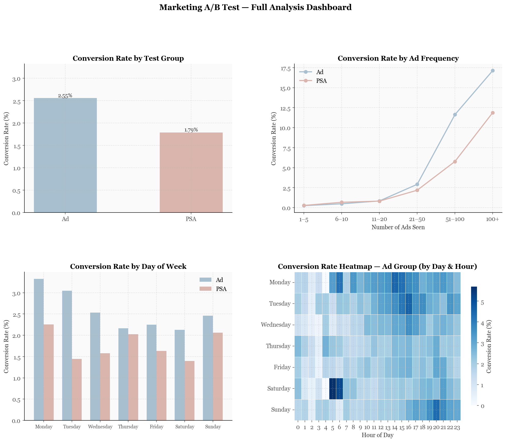

# Marketing A/B Test Analysis

A statistical analysis of A/B testing results from a digital marketing campaign,
examining whether a new ad creative significantly improves conversion rates.

## Project Overview

In digital marketing, A/B tests are run to compare two versions of a campaign
(control vs. treatment) and determine which performs better. This project applies
statistical hypothesis testing to evaluate whether observed differences in
conversion rates are statistically significant or due to random chance.

## Dataset

**Source:** [Marketing A/B Testing Dataset – Kaggle](https://www.kaggle.com/datasets/faviovaz/marketing-ab-testing)

This dataset contains results from an A/B test where:
- **Control group** saw a Public Service Announcement (PSA)
- **Treatment group** saw an advertisement

## Methods

- Exploratory Data Analysis (EDA)
- Two-proportion Z-test for statistical significance
- Chi-square test
- Confidence interval estimation
- Visualizations: conversion rate bar charts, distribution plots

## Project Structure

ab-test-marketing-analysis/
│
├── data/               # Raw dataset (not tracked by git)
├── notebooks/
│   └── ab_test_analysis.ipynb   # Main analysis notebook
├── README.md
├── requirements.txt
└── .gitignore

## Tools & Libraries

- Python 3.x
- pandas
- numpy
- scipy
- matplotlib
- seaborn
- Jupyter Notebook

## Results

## Results

### Statistical Test
| Metric | Value |
|--------|-------|
| Ad group conversion rate | 2.55% (n=564,577) |
| PSA group conversion rate | 1.79% (n=23,524) |
| Absolute lift | 0.77% |
| Relative lift | 43.1% |
| Z-statistic | 7.3701 |
| P-value | < 0.0001 |
| Statistically significant | Yes |

### Key Findings
1. **Ad effectiveness confirmed**: The ad group outperformed the PSA group with 43.1% relative lift, statistically significant at the 99.99% confidence level.
2. **Frequency effect**: Conversion rate increases with ad exposure (0.25% at 1–5 ads → 17.1% at 100+ ads), though this likely reflects selection bias rather than a causal relationship.
3. **Day-of-week patterns**: Monday (3.32%) and Tuesday (3.04%) show the highest conversion rates; Thursday through Saturday are consistently lower.
4. **Optimal time windows**: Afternoon to evening hours (14:00–22:00) show the highest conversion rates across all days.

### Dashboard

## Author

**Jinhui (Amy) Tang**
NYU Steinhardt, BS Media, Communication & Culture | Minor: Computer Science
